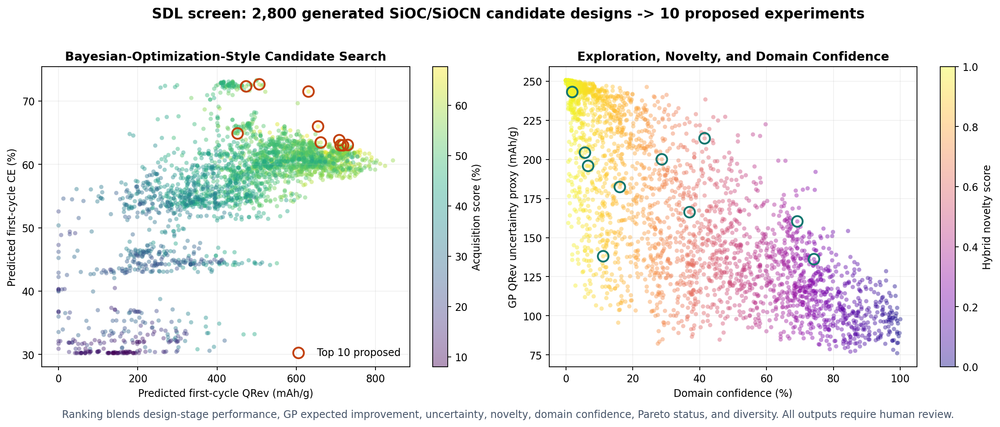
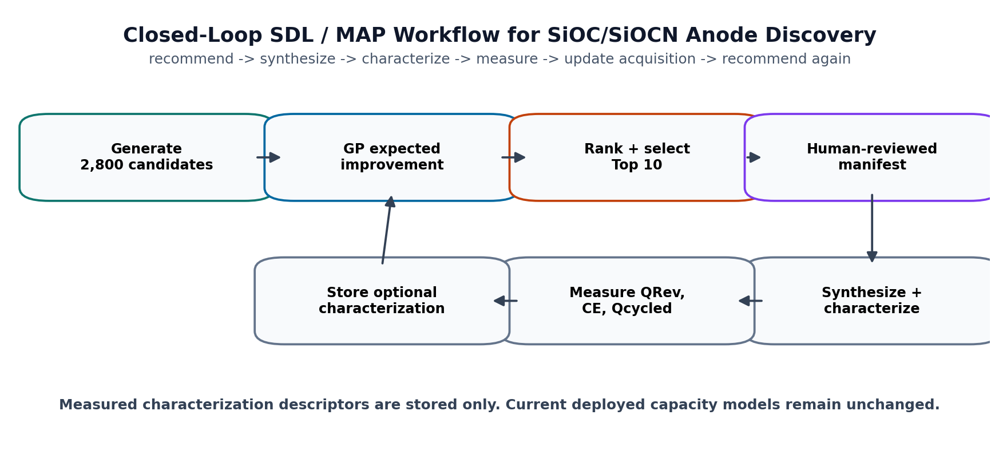
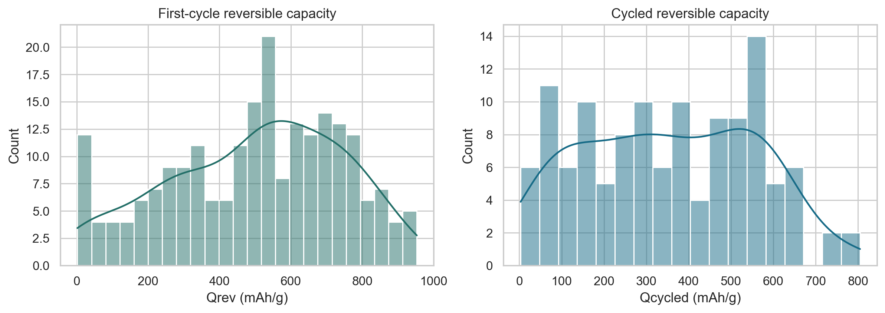
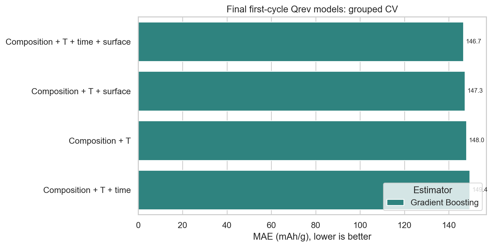
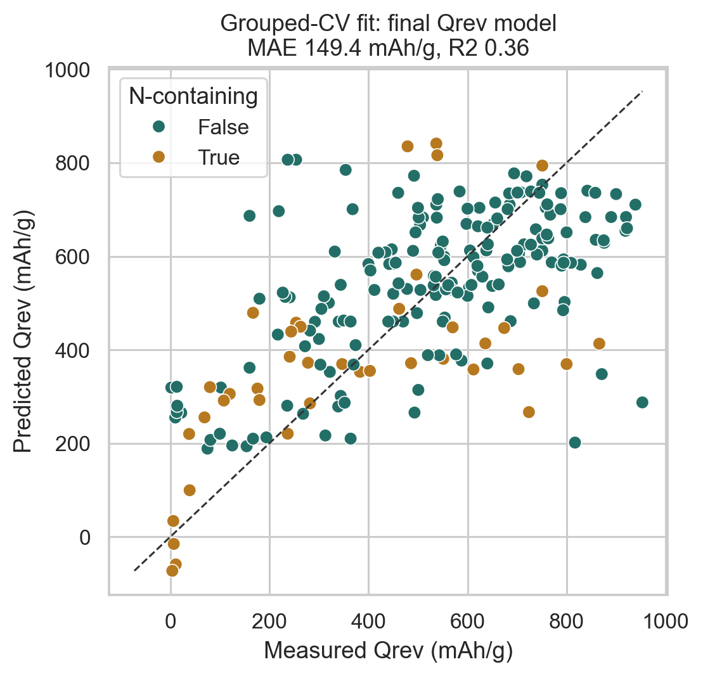
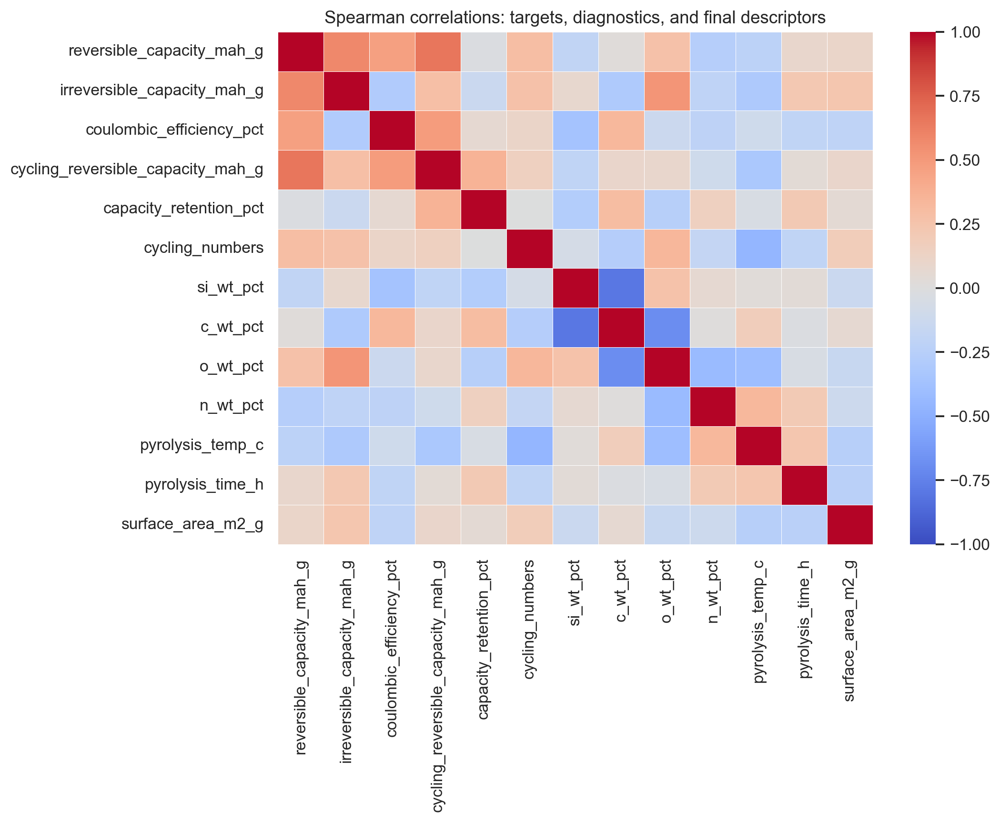
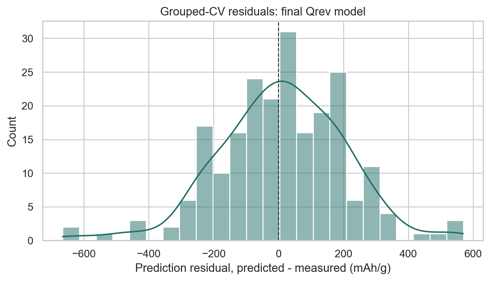
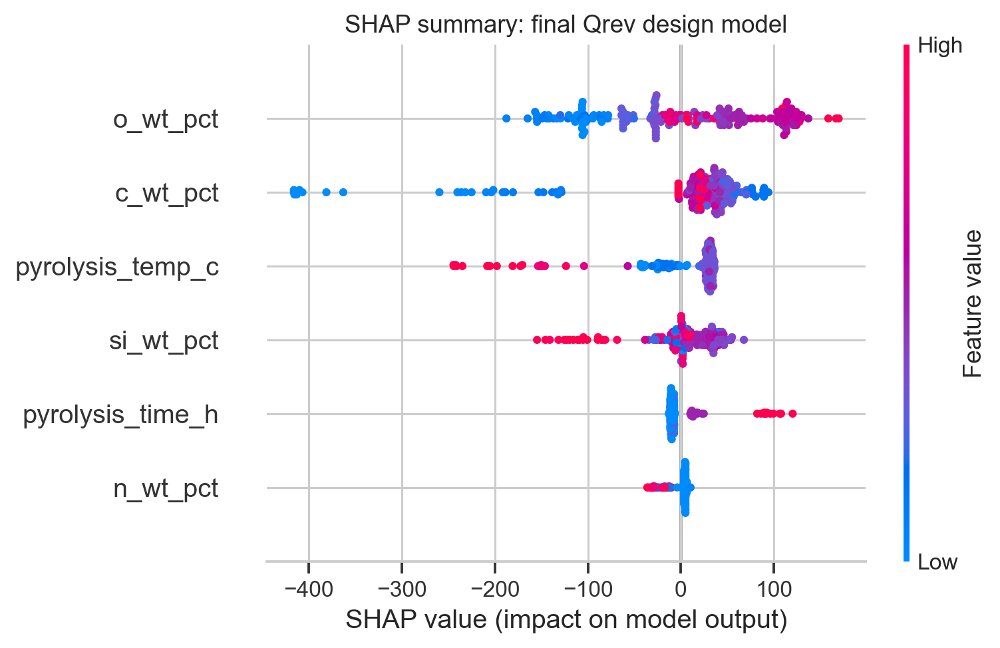
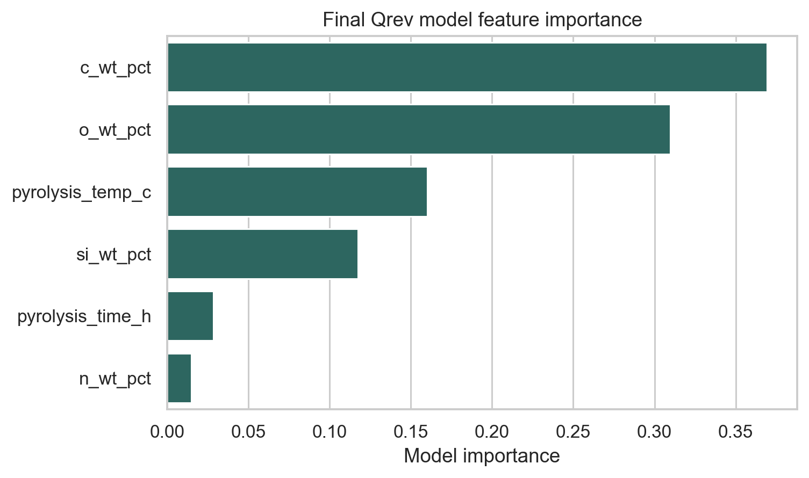

# SiOC/SiOCN Anode Discovery Modeling

[](https://www.python.org/)
[](https://streamlit.io/)
[](https://scikit-learn.org/)
[](#)
[](#)
[](#)
[](#)
[](https://shap.readthedocs.io/)
[](LICENSE)

This project is a **materials informatics and chemical data science workflow** for screening polymer-derived Si-O-C and N-doped Si-O-C/Si-C-N anode materials for lithium-ion batteries.

The project links elemental composition, pyrolysis conditions, and optional measured surface area to first-cycle and cycled electrochemical performance. Precursor chemistry and DVB modification are retained for route suggestion, not as direct capacity-prediction features. The workflow uses DOI/reference-grouped validation to reduce over-optimistic results from repeated samples within the same paper.

## Project Aim

The scientific goal is to support discovery of stable Si-O-C based anodes by asking:

- Which Si/C/O/N compositions are promising for reversible lithium-storage capacity?
- Which precursor families can plausibly produce a target composition?
- How do predicted first-cycle capacity, irreversible loss, Coulombic efficiency, and cycled capacity compare?
- Which trends are reliable enough for discussion, and which are limited by the small literature dataset?

## Current App Workflow

The Streamlit app is the recommended entry point for interactive screening.

```bash
pip install -r requirements.txt
streamlit run streamlit_app.py
```

The cleaned literature CSVs are intentionally not included in the public repository. For local reproduction, place the non-redistributed curated dataset at:

```text
data/sioc_battery_capacity_clean_updated.csv
```

For deployment, the app needs the compact model bundle:

```text
models/sioc_app_target_models.joblib
```

Other trained `.joblib` files are excluded. The app can run without the non-redistributed CSV using sanitized public reference objects stored inside the model bundle: aggregate input-range statistics, aggregate route-family summaries, and a curated public literature-analog table with DOI/source metadata. The committed reports, figures, and model-summary CSVs document the final analysis without publishing the raw cleaned literature table.

For a public Streamlit deployment, do **not** commit the non-redistributed CSV. The committed `sioc_app_target_models.joblib` contains trained pipelines, compact CV-summary tables, aggregate range statistics, aggregate route-family summaries, and a **public-safe analog subset** with only selected literature metadata needed for app transparency: precursor labels, Si/C/O/N composition, pyrolysis conditions, selected performance context, reference text, and DOI/source link. It does not contain extraction notes, raw PDFs, electrolyte details, or the full cleaned table. When the CSV is absent, the app still predicts performance, shows full training-range checks from aggregate statistics, suggests literature-guided route families, and lists nearest public DOI/source analogs.

The deployed bundle follows the curated final dataset. The Wu 2022 high-capacity PMSQ + DVB series was examined as an external challenge case, but it is not part of the final training CSV because the current composition + pyrolysis descriptors do not explain that source well.

The app uses a single composition-first workflow:

- **Target material prediction**: enter Si/C/O/N wt.%, final pyrolysis temperature/time, optional BET surface area, and cycle number.
- **Synthesis route guidance**: after prediction, inspect precursor/process routes. Public deployment uses the curated public analog subset for composition-matched literature context and DOI/source links; local runs with the cleaned CSV can inspect the fuller curated table. These route suggestions do not change the predicted electrochemical values.

Elemental composition inputs are bounded by physical wt.% limits (`0-100`) rather than by the training-set extrema. This allows discovery of N-rich or otherwise new compositions. The app flags out-of-training compositions as extrapolative, so those predictions should be treated as hypotheses for synthesis and testing.

Predicted outputs:

- `QRev`: first-cycle reversible capacity.
- `QIrrev`: first-cycle irreversible capacity calculated from predicted `QRev` and CE.
- `CE`: first-cycle Coulombic efficiency.
- `QCycled`: cycled reversible capacity at 50, 100, or 200 cycles.
- `Apparent Retention`: `100 * QCycled / QRev`.

The public app defaults to the **best grouped-CV diagnostic workflow** for CE and `QCycled`: first `QRev` is predicted from composition + pyrolysis, then CE and `QCycled` use that predicted `QRev` as an additional diagnostic feature. Strict design-only CE and `QCycled` modes remain available for users who want predictions without any first-capacity-assisted diagnostic step.

The app interprets predictions under the dominant literature protocol:

- Low-current testing, approximately 0.05-0.1C graphite-equivalent.
- Voltage window near 0-3 V.
- Primarily inert/protective pyrolysis atmosphere.

## Literature-Guided Synthesis Routes

After prediction, the app can suggest chemically meaningful literature route families, including:

- Phenylalkyl, alkyl, vinyl, and phenyl polysiloxanes.
- Alkoxysilane-derived polysiloxanes such as PhTES, MTES, VTES, TEOS, and mixed PhTES/TEOS routes.
- Polysilazane/polyorganosilazane and silylcarbodiimide families for intrinsic N-containing SiOCN/SiCN-like chemistry.
- Explicit low-N additive routes such as polysiloxane + PVP/pyrrole, where nitrogen comes from the additive rather than the polysiloxane backbone.
- Carbon-rich blends, silicone oil, polycarbosilane, polysilsesquioxane, and organopolysilane copolymer routes.

The route table is filtered by a **family match (%)** score. This score asks whether that precursor family is chemically/compositionally plausible for the entered Si/C/O/N target. The matching distance uses only elemental composition (`Si`, `C`, `O`, `N` wt.%), so the suggested recipes are composition analogs rather than copied electrochemical performance. In public deployment without the full cleaned CSV, the same UI uses the curated public analog subset stored in the model bundle and shows DOI/source links where available. For N-containing targets, plain polysiloxanes are penalized unless an explicit PVP/pyrrole additive route is selected.

## Self-Driving Lab / MAP Extension

The project now includes an SDL/MAP-style next-experiment recommendation prototype inspired by modern closed-loop materials discovery workflows. It follows general self-driving-lab ideas: candidate generation, Bayesian-optimization-style acquisition, novelty/domain scoring, human-reviewed experiment manifests, measurement ingestion, and iterative recommendation.

The extension uses only the committed public model bundle. It:

- generates local and exploratory SiOC/SiOCN compositions with bounded Si/C/N contents and a configurable default pyrolysis window of 800-1400 C for 0.5-6 h,
- predicts design-stage `QRev`, CE, `QIrrev`, and `QCycled`,
- fits a Gaussian-process uncertainty layer for expected-improvement screening,
- combines performance, uncertainty, configurable novelty/domain scoring, and Pareto status,
- selects a diverse set of proposed experiments,
- attaches the composition-nearest public literature context and DOI,
- exports a structured JSON manifest for expert review, ELN capture, and future robot integration,
- requests replicate batches so reproducibility is treated as an experimental output.

The GitHub demo configuration screens exactly **2,800 generated candidate material/process
designs** and selects the **top 10 proposed experiments**. The ranking is Bayesian-optimization
style: a Gaussian-process acquisition layer estimates QRev uncertainty and expected improvement,
then combines this with predicted performance, novelty, domain confidence, Pareto status, and
diversity. All suggestions remain `proposed_human_review_required`.





Novelty scoring supports four modes:

- `legacy`: standardized nearest-neighbor distance; the backward-compatible default.
- `mahalanobis`: covariance-aware distance estimated with Ledoit-Wolf shrinkage.
- `kde`: Gaussian kernel-density novelty.
- `hybrid`: equal combination of Mahalanobis and KDE novelty percentiles.

Run the command-line workflow:

```bash
python scripts/suggest_next_experiments.py \
  --n-candidates 2800 \
  --n-suggestions 10 \
  --cycle-number 100 \
  --novelty-method hybrid
```

The CLI default is `2,500` candidates for a faster local run; the README figures use the explicit
`2,800`-candidate demo command above.

Generated outputs are written to the ignored local directory `reports/sdl_runs/`:

```text
ranked_candidate_space.csv
next_experiments.csv
experiment_manifest.json
```

The explainable initial-recommendation demonstration is available in:

```text
notebooks/06_sdl_active_learning_extension.ipynb
```

### Closed-Loop Measurement Update

The closed-loop extension accepts measured replicates from a previous recommendation batch,
appends them to a versioned measurement history, updates only the GP acquisition/reference
layer, and generates a new ranked batch:

```bash
python scripts/update_sdl_with_measurements.py \
  --prior-manifest reports/sdl_runs/experiment_manifest.json \
  --recommendations reports/sdl_runs/next_experiments.csv \
  --measurements path/to/measured_results.csv \
  --novelty-method hybrid
```

Measurement rows are joined by `experiment_id` or `candidate_id`. Supported status values are
`completed`, `failed`, `partial`, and `excluded`; quality flags are `pass`, `warning`, `fail`,
and `not_assessed`. Optional stored characterization fields are:

```text
crystallinity_pct
grain_size_nm
bet_surface_area_m2_g
raman_d_g_ratio
pore_volume_cm3_g
```

These characterization values are stored for provenance and future model development. They are
explicitly removed before current production feature engineering. Completed, non-failing measured
`QRev` values update only the fixed-kernel GP acquisition and novelty/reference layers; the
deployed QRev, CE, and `QCycled` models are neither retrained nor replaced.

Each update exports a new recommendation CSV, JSON manifest, `run_metadata.json`, cumulative
`measurement_history.csv`, and a timestamped history snapshot. Failed experiments and replicate
statistics remain visible in the manifest. All new candidates retain
`status = proposed_human_review_required`.

The complete mock-measurement workflow is demonstrated in:

```text
notebooks/07_sdl_closed_loop_retraining_demo.ipynb
```

The manifest follows [schemas/sioc_sdl_experiment.schema.json](schemas/sioc_sdl_experiment.schema.json). It separates steps suitable for automated liquid handling, mixing, heating, sonication, washing, and metadata capture from external or future modules for drying, inert pyrolysis, solid dosing, electrode fabrication, cell assembly, and electrochemical testing.

This is a decision-support layer, not an autonomous hardware-control system. Precursor selection, hardware compatibility, safety constraints, synthesis feasibility, and all proposed experiments require expert review before execution.

## Leakage-Controlled Feature Policy

The final deployed models avoid post-electrochemistry leakage. In earlier exploratory notebooks, features such as irreversible capacity, CE, cycled capacity, and retention could artificially improve reversible-capacity prediction because they are measured after electrochemical testing.

The deployed first-cycle design model uses:

- `si_wt_pct`
- `c_wt_pct`
- `o_wt_pct`
- `n_wt_pct`
- `pyrolysis_temp_c`
- `pyrolysis_time_h`

The optional surface-assisted model adds raw `surface_area_m2_g` when BET surface area is known. It does not use `log_surface_area_m2_g`.

Current density, voltage window, pre-pyrolysis details, pyrolysis atmosphere, polymer family, and DVB loading are treated as context/route-recommendation descriptors rather than active deployed-model inputs. The cleaned literature table is dominated by low-current, 0-3 V, inert/protective pyrolysis rows, while polymer family and DVB can otherwise make the model change capacity even when elemental composition is unchanged.

The app defaults to the diagnostic CE and cycled-capacity modes using predicted first-cycle `QRev`, because first-cycle behavior contains real information about irreversible loss and later capacity. Strict design-only CE and cycled-capacity modes remain available and are reported separately.

Shuffle-split results are shown in the notebook and app **only as an optimistic diagnostic**. The deployed app uses the grouped-validation model policy, because random shuffling can place neighboring samples from the same paper or precursor series into both train and test folds.

## Model Summary

Main validation uses DOI/reference-grouped cross-validation. `QIrrev` is calculated in the app from `QRev` and CE rather than deployed as an independent prediction card.

| Target | Deployed/Best Use | Model | Rows | Groups | MAE | R2 |
|---|---:|---|---:|---:|---:|---:|
| First-cycle `QRev` | Deployed design model: composition + pyrolysis | Gradient Boosting | 219 | 45 | 149.45 mAh/g | 0.362 |
| First-cycle `QRev` | Optional surface-assisted model | Gradient Boosting | 219 | 45 | 146.65 mAh/g | 0.389 |
| First-cycle CE | Design-only model | Random Forest | 205 | 45 | 8.08% | 0.324 |
| First-cycle CE | **Default diagnostic model using predicted first-cycle `QRev`** | Random Forest | 205 | 45 | 7.54% | 0.400 |
| `QCycled` | Design-only model: composition + pyrolysis + cycle number | Extra Trees | 123 | 37 | 172.49 mAh/g | -0.014 |
| `QCycled` | Optional surface-assisted design model | Random Forest | 123 | 37 | 170.35 mAh/g | -0.029 |
| `QCycled` | **Default diagnostic model using predicted first-cycle `QRev`** | Ridge | 123 | 37 | 123.09 mAh/g | 0.480 |
| `QCycled` | Optional surface-assisted diagnostic model using first-cycle `QRev` | Gradient Boosting | 123 | 37 | 123.06 mAh/g | 0.424 |

The shuffled-CV values are intentionally not used for selecting the deployed models. They are shown in the app/notebook as an upper-bound diagnostic for interpolation within known literature families.

ANN/MLP benchmarks were tested but did not outperform tree/linear models under grouped validation. This is expected for a small, heterogeneous literature dataset.

## Key Figures

The README keeps a small curated figure set: target distribution, grouped-CV model fit, feature-set comparison, leakage diagnostics, residuals, and model explanation. The notebook contains the fuller analysis.

### Target Distribution



### Grouped-CV Feature-Set Comparison



### Model Fit: First-Cycle Design Model

This plot shows predicted versus observed first-cycle reversible capacity for the leakage-controlled design-stage model.



### Leakage and Feature-Set Diagnostics



### Residuals



### Model Explanation





## Project Structure

```text
.
├── models/
│   ├── sioc_app_target_models.joblib
├── notebooks/
│   ├── 05_final_clean_sioc_discovery_modeling.ipynb
│   ├── 06_sdl_active_learning_extension.ipynb
│   └── 07_sdl_closed_loop_retraining_demo.ipynb
├── reports/
│   ├── figures/
│   ├── final_simplified_model_best_by_feature_set.csv
│   ├── final_simplified_model_cv_results.csv
│   ├── final_feature_policy.md
│   └── notebook_run_comparison.md
├── schemas/
│   └── sioc_sdl_experiment.schema.json
├── scripts/
│   ├── create_final_explainable_notebook.py
│   ├── create_sdl_closed_loop_notebook.py
│   ├── create_sdl_extension_notebook.py
│   ├── create_sdl_readme_figures.py
│   ├── suggest_next_experiments.py
│   ├── train_final_app_models.py
│   ├── update_sdl_with_measurements.py
│   └── update_report_figures.py
├── src/
│   ├── features.py
│   └── sdl.py
├── tests/
│   └── test_sdl_closed_loop.py
├── streamlit_app.py
├── CITATION.cff
├── LICENSE
├── requirements.txt
├── runtime.txt
└── README.md
```

Private/local files are intentionally ignored: `data/*.csv`, development model bundles, sample-level report CSVs, executed notebooks, Python caches, and notebooks `01`-`04`.

## Reproduce the Final Notebook

```bash
python scripts/create_final_explainable_notebook.py
jupyter nbconvert --to notebook --execute notebooks/05_final_clean_sioc_discovery_modeling.ipynb \
  --output ../reports/executed_notebooks/05_final_clean_sioc_discovery_modeling_executed.ipynb \
  --ExecutePreprocessor.timeout=1200
```

The executed notebook writes the final CSV summaries, figures, and model bundles used by the app. Full reproduction requires the non-redistributed cleaned literature dataset in `data/`.

Run the lightweight SDL validation suite with:

```bash
python -m unittest tests.test_sdl_closed_loop -v
```

## Recommended Interpretation

Use the app and final notebook as a **decision-support tool**, not as a replacement for synthesis/characterization. The grouped-CV errors are still large because the dataset is small and heterogeneous, especially for N-doped and cycled-capacity subsets.

The safest final story is:

- The compact design-stage model is the primary screening model.
- Phase proxies and SHAP are useful for interpretation and discussion.
- Diagnostic CE and cycled-capacity models using predicted `QRev` are the app defaults because they are the best grouped-CV workflow.
- Design-only CE and `QCycled` remain available as stricter pre-test screening modes.
- Suggested recipes are literature-guided composition analogs, not alternate ML predictions and not direct copies of literature capacities.

## Roadmap

- Deploy the public Streamlit app with the compact model bundle and no full cleaned CSV.
- Add a public app screenshot after deployment so readers see the interactive workflow immediately.
- Expand the curated dataset with additional SiOC/SiOCN literature after manual quality control.
- Add uncertainty communication for predictions near the edge of the training range.
- Add an optional restricted analog-search backend for full literature-route suggestions without committing the raw dataset.
- Benchmark future descriptor sets for N-containing samples as more SiOCN data become available.
- Connect the closed-loop manifest and measurement history to an ELN/LIMS endpoint and validated laboratory hardware adapters.
- Replace fixed candidate-pool screening with sequential Bayesian optimization after a larger internally consistent experimental campaign.
- Add validated external modules for inert pyrolysis, solid dosing, electrode fabrication, and electrochemical testing.

## License

This project is released under the MIT License. See [LICENSE](LICENSE).

The trained model bundle is provided for research and educational use as part of this repository. The cleaned literature dataset used to train the model is intentionally not redistributed.

## Citation / Attribution

If you use this workflow, app, figures, or model bundle in academic or technical work, please cite:

```text
Maged Bekheet. SiOC/SiOCN Anode Discovery Modeling: leakage-controlled machine-learning
and Streamlit workflow for polymer-derived lithium-ion battery anodes. GitHub repository,
2026. https://github.com/magedbekheet/siocn-lib-anode-discovery
```

For formal citation metadata, see [CITATION.cff](CITATION.cff).

Please also cite the original literature sources for any experimental data, compositions, or synthesis routes used in downstream analysis. The full cleaned CSV is a curated literature-derived table and is not published in this repository.

## Disclaimer

This repository is a research decision-support tool. Predictions are not guaranteed synthesis outcomes, electrochemical measurements, safety recommendations, or commercial material specifications. Model errors remain significant because the available literature dataset is small, heterogeneous, and unevenly sampled across N-doped compositions, surface area reporting, cycling protocols, and precursor families.

Use the outputs to prioritize hypotheses and discussion, then validate promising compositions experimentally with appropriate characterization and electrochemical testing.

## Contributing

Contributions are welcome when they improve reproducibility, documentation, app usability, or scientifically justified feature engineering.

Good contribution types include:

- bug fixes for the Streamlit app or feature engineering
- clearer documentation and figures
- new validation diagnostics that avoid electrochemical leakage
- carefully curated public example data or schema improvements
- model-card style discussion of limitations and uncertainty

Please do not commit private literature tables, copyrighted PDFs, large local artifacts, or model files other than the compact deployment bundle documented in this README.

## Notes for GitHub Push

Generated Python caches, private datasets, sample-level report files, and Windows `Zone.Identifier` sidecar files should not be committed. For Streamlit deployment, keep `models/sioc_app_target_models.joblib`; ignore the other development model bundles. The public app can run from this model bundle without the raw dataset. The project should keep the final notebook, app, model summaries, and selected report figures so readers can reproduce the modeling discussion.
